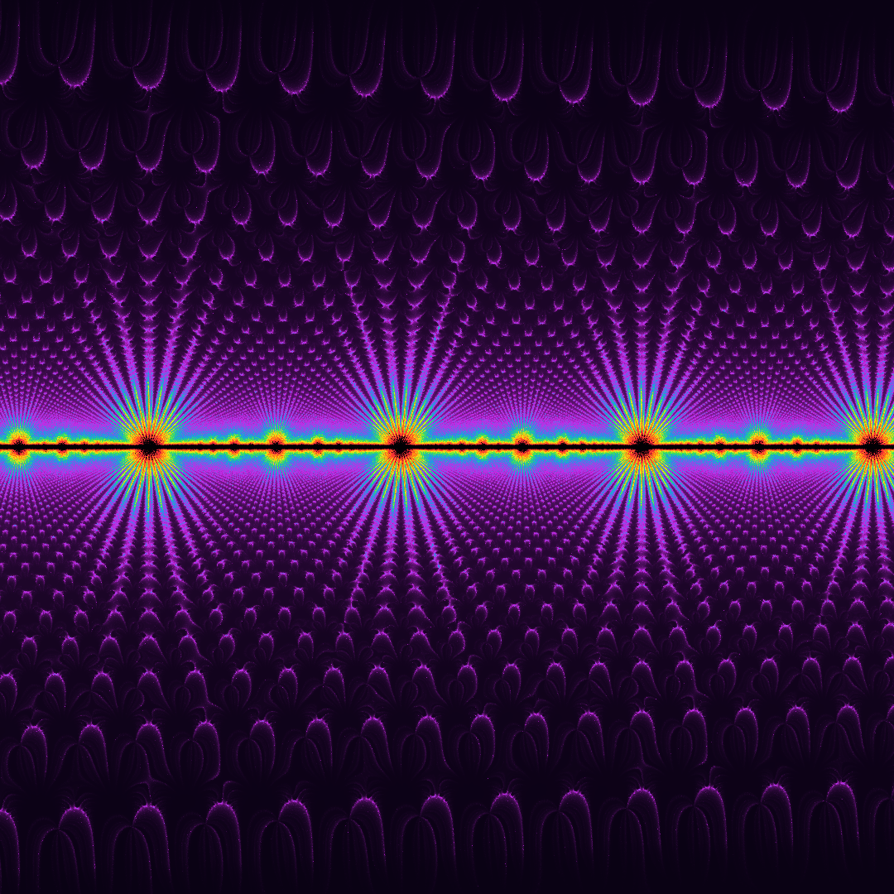

# Fractal Renderer

This is a very simple program used to render fractals to images using a parameter json file.

It includes different fractal kinds among which the Mandelbrot set and a (potentially new) kind of fractal I came up with by using second- and third-degree recursive sequences instead of the classic first-degree recursive pattern used to draw the Mandelbrot set..

# How to use

First, download the latest executable from the [releases tab](https://github.com/valflrt/fractal_renderer/releases/latest).

Next, create a json file that with the following structure (see [parameter file reference](#parameter-file-reference)):

```jsonc
{
  "img_width": ...,
  "img_height": ...,
  "zoom": 1.0,
  "center_x": 0.0,
  "center_y": 0.0,
  "max_iter": 80000,
  "sampling": "Medium",
  "fractal": ...,
  "coloring_mode": "CumulativeHistogram"
}
```

> [!WARNING]
> I added comments to explain each parameter, but they shouldn't appear in the file because json doesn't support comments by default.

Then, in order to render your fractal, run the following command:

```
./fractal_renderer path/to/param_file.json path/to/output_image.png
```

> [!NOTE]
> Supported image formats are png and jpg (extension used to guess image format)

Alternatively, if you have rust installed and downloaded this repository:

```
cargo run -r -- fractal.json fractal.png
```

# Preset renders

These are preset renders I find pretty, you can get their json parameters files by clicking on the title. There are some more in [`presets/`](./presets/).

### [ukhbrp.json](./presets/ukhbrp.json)


### [ebidxr.json](./presets/ebidxr.json)


### [mzfyje.json](./presets/mzfyje.json)


### [ztkhky.json](./presets/ztkhky.json)


### [idkzrg.json](./presets/idkzrg.json)



### [datgdv.json](./presets/datgdv.json)


# Parameter file reference

- `img_width` and `img_height`: Set image width and height (integers, in pixel).

- `zoom`: Set zoom (float).

- `center_x` and `center_y`: Set the position of the center of the render area (floats).

  > [!NOTE]
  > This corresponds to coordinates of the center of the render area in the complex plane: `z = center_x + i * center_y`

- `max_iter`: Set the maximum iteration count (around 80000 recommended).

- `fractal_kind`: Set the fractal you want to draw. Available options are:

  - `"Mandelbrot"`
  - `"SecondDegreeWithGrowingExponent"`
  - `"ThirdDegreeWithGrowingExponent"`
  - `{ "NthDegreeWithGrowingExponent": n }`

- `coloring_mode`: _(optional)_ Set the way pixels are colored. Available options are:

  - `"BlackAndWhite"`: Draws pixels black if the maximum iteration count has been reached, otherwise white.
  - `"Linear"`: Maps the iteration count for a pixel to a value between 0 and 1 by dividing it by the maximum iteration count and uses this value to pick a color from the gradient.
  - `"Squared"`: Similar to `"Linear"`, but the value between 0 and 1 is squared before picking a color from the gradient.
  - `"LinearMinMax"`: Maps the iteration count for a pixel to a value between 0 and 1, where 0 corresponds to the minimum iteration count and 1 corresponds to the maximum iteration count in the entire image.
  - `"CumulativeHistogram"` _(default)_ More information [here](https://en.wikipedia.org/wiki/Plotting_algorithms_for_the_Mandelbrot_set#Histogram_coloring).

- `sampling`: _(optional)_ Set sampling level: higher values take more samples and (hopefully) give a smoother result. This is not currently working very well. Available options are:

  - `"Single"`: Takes only one sample per pixel.
  - `"Low"`: _(default)_
  - `"Medium"`
  - `"High"`
  - `"Ultra"`
  - `"Extreme"`

- `custom_gradient`: _(optional)_ Set a custom gradient. This is an array of array of the form `[t, [r, g, b]]` where `t` is a float between 0 and 1 and `r`, `g`, `b` the color at that point in the gradient. Colors in between are interpolated.

  Example:

  ```
  {
    ...
    "custom_gradient": [
      [0., [10, 2, 20]],
      [0.1, [200, 40, 230]],
      [0.25, [20, 160, 230]],
      [0.4, [60, 230, 80]],
      [0.55, [255, 230, 20]],
      [0.7, [255, 120, 20]],
      [0.85, [255, 40, 60]],
      [0.95, [2, 0, 4]]
    ]
    ...
  }
  ```

- `dev_options`: _(optional)_ For development purposes.
  - `save_sampling_pattern`: _(optional)_ Save the sampling pattern as an image.
  - `display_gradient`: _(optional)_ Draw the gradient used for coloring in the bottom right corner of the image.
